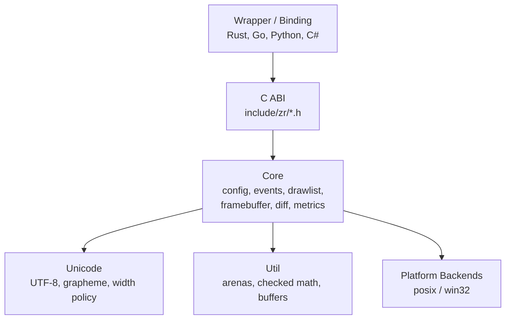

```{=html}
<p align="center">
```
``{=html}
```{=html}
</p>
```
```{=html}
<p align="center">
```
`<em>`{=html}A deterministic terminal rendering engine in
C`</em>`{=html}
```{=html}
</p>
```
```{=html}
<p align="center">
```
`<a href="https://github.com/RtlZeroMemory/Zireael/actions/workflows/ci.yml">`{=html}``{=html}`</a>`{=html}
`<a href="https://github.com/RtlZeroMemory/Zireael/releases">`{=html}``{=html}`</a>`{=html}
`<a href="https://rtlzeromemory.github.io/Zireael/release-model/">`{=html}``{=html}`</a>`{=html}
`<a href="LICENSE">`{=html}``{=html}`</a>`{=html}
`<a href="https://rtlzeromemory.github.io/Zireael/">`{=html}``{=html}`</a>`{=html}
```{=html}
</p>
```

------------------------------------------------------------------------

## Overview

Zireael is a **low-level terminal rendering engine** for embedding in
higher-level TUI frameworks.\
It is intentionally narrow: wrappers submit a versioned binary drawlist,
and receive a versioned packed event batch.

``` text
Wrapper / Host Runtime                 Zireael Engine
----------------------                 --------------

 drawlist bytes         ----------->   engine_submit_drawlist()
                                       engine_present()   (diff + single flush)

 event batch bytes      <-----------   engine_poll_events()
```

The primary reference integration is Rezi:\
https://github.com/RtlZeroMemory/Rezi

Rezi is a TypeScript TUI framework built directly on top of Zireael.

------------------------------------------------------------------------

## Engine Capabilities

Beyond traditional cell-grid rendering, Zireael exposes primitives most
terminal engines do not implement.

### Extended Styles

-   Full SGR colon-subparameter support
    -   curly underline\
    -   dotted underline\
    -   dashed underline\
    -   double underline\
-   Independent underline color (SGR 58)\
-   OSC 8 inline hyperlinks with ID deduplication\
-   Fully diff-aware style emission (only changed attributes are
    written)

### Terminal Capability Detection

Active probing during engine initialization:

-   XTVERSION
-   DA1 / DA2
-   DECRQM mode queries
-   Cell pixel size measurement

Builds a structured terminal profile (kitty, iTerm2, WezTerm, ghostty,
xterm, etc.) with explicit feature flags.\
Falls back to TERM / COLORTERM heuristics when probing is unavailable.

### Sub-Cell Rendering

    Halfblock  ██    Quadrant  ▗▘    Sextant  🬞🬓    Braille  ⡷⣸
    1×2 px/cell      2×2 px/cell     2×3 px/cell      2×4 px/cell
    2 colors         2 colors        2 colors          1 color

Four blitter backends with unified API:

-   Halfblock (1×2)
-   Quadrant (2×2)
-   Sextant (2×3)
-   Braille (2×4)

Each increases effective resolution within standard terminal cells ---
enabling line drawing, filled regions, pixel grids, and charts ---
without requiring graphics protocol support.

Automatic best-blitter selection based on detected terminal
capabilities.

------------------------------------------------------------------------

## Project Status

Zireael is currently in **alpha**.

-   APIs and wire formats are versioned
-   Pre-GA iteration is active
-   Wrapper authors should pin exact versions
-   Expect fast-moving minor-line changes while alpha continues

See `docs/release-model.md` for release-channel policy.

------------------------------------------------------------------------

## What it is

-   A deterministic C engine with a small public ABI
-   A versioned binary protocol pair (drawlist in, events out)
-   A boundary-safe core (`src/core`, `src/unicode`, `src/util`)
-   OS code isolated strictly in `src/platform/*`

## What it is not

-   Not a widget/layout framework
-   Not an app runtime
-   Not a high-level immediate mode text API

------------------------------------------------------------------------

## Design Guarantees

-   Binary in / binary out (versioned wire formats)
-   Locked ownership model (engine owns engine allocations)
-   Buffer-oriented API
-   Determinism (pinned versions + pinned Unicode policy)
-   Strict platform boundary isolation
-   No partial effects on failure
-   Single flush per present()

------------------------------------------------------------------------

## Architecture



------------------------------------------------------------------------

## Quickstart

### Linux / macOS

``` bash
cmake --preset posix-clang-debug
cmake --build --preset posix-clang-debug
ctest --test-dir out/build/posix-clang-debug --output-on-failure
./out/build/posix-clang-debug/zr_example_minimal_render_loop
```

### Windows (clang-cl)

``` powershell
.\scripts\vsdev.ps1
cmake --preset windows-clangcl-debug
cmake --build --preset windows-clangcl-debug
ctest --test-dir out/build/windows-clangcl-debug --output-on-failure
.\out\build\windows-clangcl-debug\zr_example_minimal_render_loop.exe
```

### Guardrails

``` bash
bash scripts/guardrails.sh
```

Enforces platform boundary and libc safety rules.

------------------------------------------------------------------------

## Minimal Wrapper Loop

``` c
int n = engine_poll_events(e, timeout_ms, event_buf, (int)sizeof(event_buf));
if (n < 0) { /* handle error */ }

zr_result_t rc = engine_submit_drawlist(e, drawlist_bytes, drawlist_len);
if (rc != ZR_OK) { /* handle error */ }

rc = engine_present(e);
if (rc != ZR_OK) { /* handle error */ }
```

------------------------------------------------------------------------

## Public Surface

  ---------------------------------------------------------------------------------
  Surface                 Purpose                 Source
  ----------------------- ----------------------- ---------------------------------
  C ABI                   lifecycle, polling,     `include/zr/zr_engine.h`
                          submit/present, config, 
                          metrics, caps, debug    
                          API                     

  Drawlist format         wrapper → engine render `include/zr/zr_drawlist.h`
                          commands                

  Event batch format      engine → wrapper input  `include/zr/zr_event.h`
                          records                 

  Terminal caps           detected features,      `include/zr/zr_terminal_caps.h`
                          profile, blitter        
                          support                 

  Version pins            library/ABI/format      `include/zr/zr_version.h`
                          negotiation constants   
  ---------------------------------------------------------------------------------

------------------------------------------------------------------------

## Documentation

-   Docs site: https://rtlzeromemory.github.io/Zireael/
-   Quickstart:
    https://rtlzeromemory.github.io/Zireael/getting-started/quickstart/
-   ABI policy: https://rtlzeromemory.github.io/Zireael/abi/abi-policy/
-   C ABI reference:
    https://rtlzeromemory.github.io/Zireael/abi/c-abi-reference/
-   Release model:
    https://rtlzeromemory.github.io/Zireael/release-model/
-   Internal specs: `docs/00_INDEX.md`

------------------------------------------------------------------------

## Versioning Snapshot

Current pins (from `include/zr/zr_version.h`):

-   Library: 1.3.8
-   Engine ABI: 1.2.0
-   Drawlist formats: v1, v2, v3, v4, v5
-   Event batch format: v1

Version pins are determinism-critical and must not be overridden.

------------------------------------------------------------------------

## Repository Scope

This repository contains the C engine only.

-   No TypeScript runtime
-   No wrapper ownership logic
-   Wrappers live in separate repositories

See https://github.com/RtlZeroMemory/Rezi for a full TUI framework built
on Zireael.

------------------------------------------------------------------------

## Contributing

See `CONTRIBUTING.md`.

Normative internal specs under `docs/` take precedence if conflicts
occur.

------------------------------------------------------------------------

## Security

See `SECURITY.md` for vulnerability reporting.

------------------------------------------------------------------------

## License

Apache-2.0 (see `LICENSE`).
