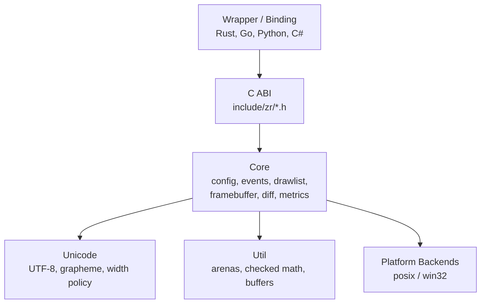

<p align="center">
  
</p>

<p align="center">
  <em>A deterministic terminal rendering engine in C</em>
</p>

<p align="center">
  <a href="https://github.com/RtlZeroMemory/Zireael/actions/workflows/ci.yml"></a>
  <a href="https://github.com/RtlZeroMemory/Zireael/releases"></a>
  <a href="LICENSE"></a>
  <a href="https://rtlzeromemory.github.io/Zireael/"></a>
</p>

---

## Overview

Zireael is a **low-level terminal rendering engine** for embedding in higher-level TUI frameworks. It is intentionally narrow: wrappers submit a versioned binary drawlist, and receive a versioned packed event batch.

```text
Wrapper / Host Runtime                 Zireael Engine
----------------------                 --------------

 drawlist bytes         ----------->   engine_submit_drawlist()
                                       engine_present()   (diff + single flush)

 event batch bytes      <-----------   engine_poll_events()
```

### What it is

- A deterministic C engine with a small public ABI
- A versioned binary protocol pair (drawlist in, events out)
- A boundary-safe core (`src/core`, `src/unicode`, `src/util`) with OS code isolated in `src/platform/*`

### What it is not

- Not a widget/layout framework
- Not an app runtime
- Not a high-level immediate mode text API

## Design Guarantees

- **Binary in / binary out**: drawlist + event batch are versioned wire formats.
- **Ownership (locked)**: engine owns engine allocations; caller never frees engine memory.
- **Buffer-oriented API**: caller supplies drawlist input bytes and event output buffers.
- **Determinism**: pinned versions, pinned Unicode policy, explicit caps.
- **Platform boundary**: OS headers/code remain in `src/platform/posix` and `src/platform/win32`.
- **No partial effects on failure**: malformed input/config errors fail cleanly.
- **Single flush per present**: `engine_present()` performs one platform write on success.

## Architecture



## Quickstart

### Build and run (Linux/macOS)

```bash
cmake --preset posix-clang-debug
cmake --build --preset posix-clang-debug
ctest --test-dir out/build/posix-clang-debug --output-on-failure
./out/build/posix-clang-debug/zr_example_minimal_render_loop
```

### Build and run (Windows, clang-cl)

```powershell
.\scripts\vsdev.ps1
cmake --preset windows-clangcl-debug
cmake --build --preset windows-clangcl-debug
ctest --test-dir out/build/windows-clangcl-debug --output-on-failure
.\out\build\windows-clangcl-debug\zr_example_minimal_render_loop.exe
```

### Guardrails

```bash
bash scripts/guardrails.sh
```

This enforces platform boundary and libc safety rules in core/unicode/util.

## Minimal Wrapper Loop

```c
/* 1) poll packed events into caller buffer */
int n = engine_poll_events(e, timeout_ms, event_buf, (int)sizeof(event_buf));
if (n < 0) {
  /* handle negative ZR_ERR_* */
}

/* 2) submit drawlist bytes */
zr_result_t rc = engine_submit_drawlist(e, drawlist_bytes, drawlist_len);
if (rc != ZR_OK) {
  /* handle error */
}

/* 3) present (diff + single flush) */
rc = engine_present(e);
if (rc != ZR_OK) {
  /* handle error */
}
```

## Public Surface

| Surface | Purpose | Source |
|---|---|---|
| C ABI | lifecycle, polling, submit/present, config, metrics, caps, debug API | `include/zr/zr_engine.h` |
| Drawlist format | wrapper -> engine render commands | `include/zr/zr_drawlist.h` |
| Event batch format | engine -> wrapper input records | `include/zr/zr_event.h` |
| Version pins | library/ABI/format negotiation constants | `include/zr/zr_version.h` |

## Documentation Map

- Docs site: <https://rtlzeromemory.github.io/Zireael/>
- Quickstart: <https://rtlzeromemory.github.io/Zireael/getting-started/quickstart/>
- ABI policy: <https://rtlzeromemory.github.io/Zireael/abi/abi-policy/>
- C ABI reference: <https://rtlzeromemory.github.io/Zireael/abi/c-abi-reference/>
- Release model: <https://rtlzeromemory.github.io/Zireael/release-model/>
- Internal normative docs index: `docs/00_INDEX.md`

## Versioning Snapshot

Current pins (from `include/zr/zr_version.h`):

- Library: `1.2.0`
- Engine ABI: `1.1.0`
- Drawlist formats: `v1`, `v2`
- Event batch format: `v1`

For evolution rules and compatibility expectations, see `docs/abi/versioning.md` and `docs/abi/abi-policy.md`.

## Repository Scope

This repository is the **C engine only**.

- No TypeScript/Node runtime layer in this repo
- No wrapper-specific ownership logic in core
- Wrappers/bindings are expected to live in separate repositories

## Contributing

See `CONTRIBUTING.md`.

Implementation-ready internal specs are under `docs/` and are authoritative when conflicts occur.

## Security

See `SECURITY.md` for vulnerability reporting and scope.

## License

Apache-2.0 (see `LICENSE`).
