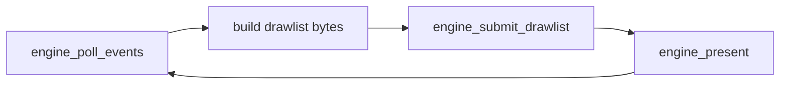

# Concepts

This section describes Zireael’s wrapper-facing model: frame loop, ownership, determinism, and caps.

## Frame loop

Wrappers control the frame cadence. The engine provides:

- `engine_poll_events()` → packs input events into caller-provided bytes
- `engine_submit_drawlist()` → validates and executes rendering commands
- `engine_present()` → diffs and emits terminal output (single flush)

## Ownership model (locked)

- The engine owns all memory it allocates.
- The caller provides buffers for drawlists (input) and event batches (output).
- The engine does not return heap pointers that the caller must free.

## Determinism

Zireael pins determinism-critical policies:

- Unicode version and width policy
- ABI/format version pins
- libc policy restrictions for core code

See: [Internal Specs → Version Pins](../VERSION_PINS.md).

## Caps and limits

Limits are explicit (example: max drawlist bytes, max commands, max output bytes per frame). These prevent unbounded work and make wrappers predictable under load.

## Next steps

- [Rendering Model](rendering-model.md)
- [Input Model](input-model.md)
- [ABI → Versioning](../abi/versioning.md)

