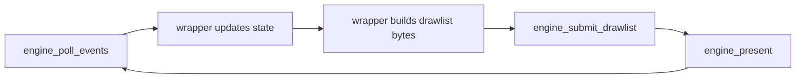

# Concepts

This section describes Zireael's wrapper-facing execution model: frame loop ownership, deterministic caps, and error handling expectations.

## Core Mental Model

Zireael is a rendering/input transport engine, not a widget system.

Wrapper responsibilities:

- own app state and layout logic
- build drawlist bytes each frame
- parse event batch bytes and dispatch to app logic

Engine responsibilities:

- validate drawlist bytes
- mutate framebuffer state
- emit minimal terminal diff output
- normalize terminal input into packed event records

## Frame Loop

Operational notes:

- `engine_poll_events()` may return `0` (timeout) even in healthy loops.
- `engine_submit_drawlist()` and `engine_present()` are separate by design.
- `engine_present()` performs one flush on success.

## Ownership Model (Locked)

- Engine owns all engine allocations.
- Callers never free engine memory.
- Caller provides drawlist input bytes and event output buffers.
- Engine does not expose heap pointers requiring caller free.

## Determinism Model

Determinism is enforced through:

- pinned public versions
- pinned Unicode/text policy
- explicit limits/caps (`zr_limits_t`)
- strict parser/validation behavior

The same pinned ABI/format requests should produce consistent behavior for equal inputs.

## Error Contract

- `0` means success (`ZR_OK`).
- negative values are failures.
- malformed input failures do not produce partial side effects.

Special case:

- `engine_poll_events()` uses integer return semantics (`bytes`, `0`, or negative error)

## Caps and Bounded Work

`zr_limits_t` constrains key resources:

- drawlist bytes/commands/tables
- per-frame output byte budget
- damage rectangle budget
- arena budgets

These caps keep runtime behavior predictable under load.

## Next Steps

- [Rendering Model](rendering-model.md)
- [Input Model](input-model.md)
- [ABI -> Versioning](../abi/versioning.md)
